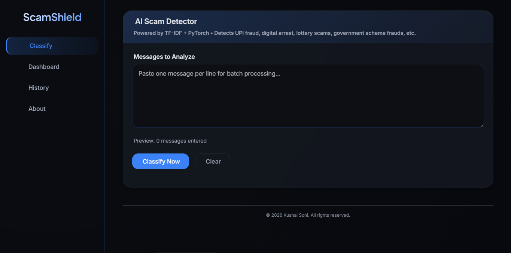
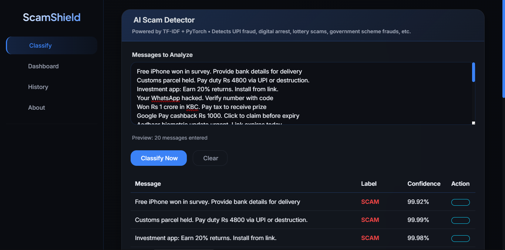
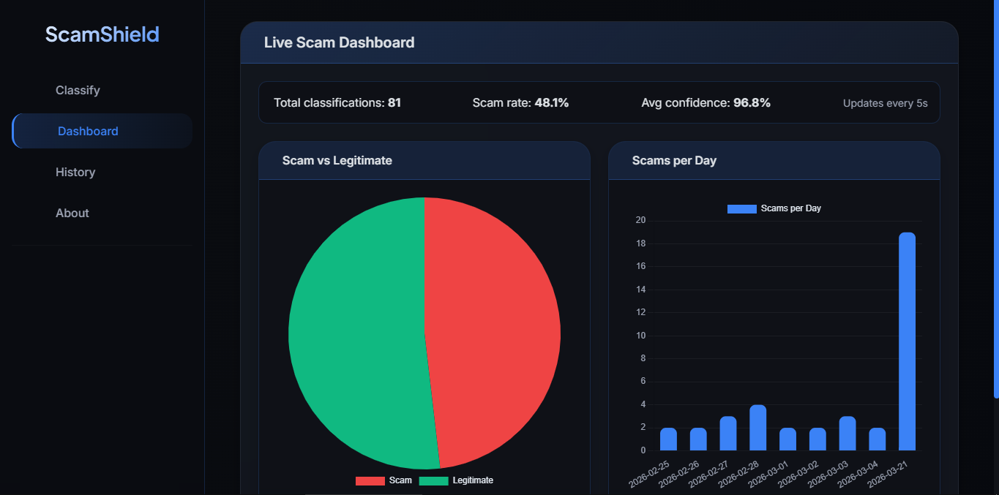
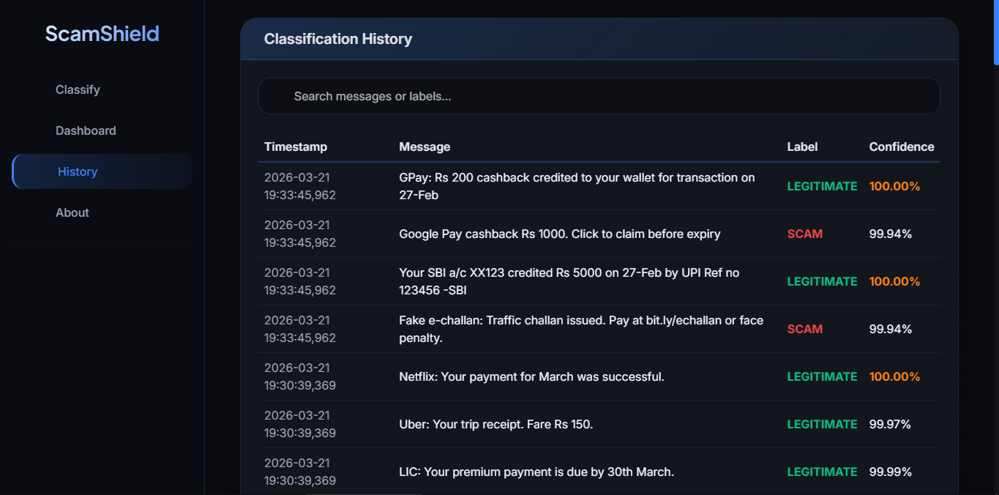
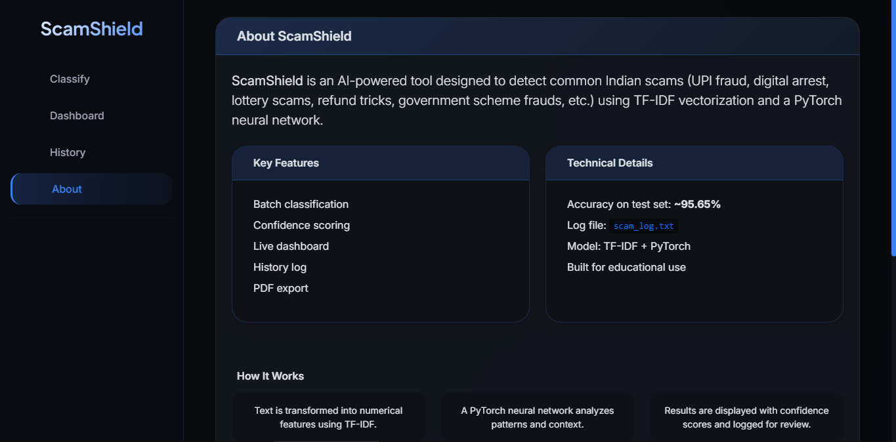

# 🛡️ ScamShield – AI Scam Message Detector

- **Capstone Project**  
- **AICTE Batch-7**  
- **IBM AI/ML Internship**

A smart, real-time scam detection system that identifies Indian scam messages such as UPI KYC fraud, Digital Arrest, Lottery/Refund scams, and Government scheme frauds. 

The project includes both a **web application** (Flask + PyTorch) and a **native Android app** (Kotlin + Material Design 3).

---

> **Note:** This project is currently a **prototype / proof of concept**. The web and Android apps are functional but intended as a foundation for further development. Some features are simplified for demonstration purposes.


---

## 💻 System Requirements

### Web Application (Local Setup)
- Operating System: Windows 10/11, macOS 10.15+, or Linux (Ubuntu 20.04+)
- Python: Version 3.9 or higher ( 3.12 recommended )
- RAM: 4 GB minimum (8 GB recommended)
- Storage: 500 MB free space
- Browser: Chrome, Firefox, Edge, or Safari (latest versions)

### Android App
- Android Version: 5.0 (API 21) to 16 (API 36)
- RAM: 1 GB minimum
- Storage: 10 MB free space
- Permissions: SMS (required), Notifications (optional)
- No internet connection required – works completely offline

> ✅ The Android APK runs on all modern Android devices, including smartphones and tablets. The web app can be hosted on any server or run locally on a laptop/desktop.

---


## 🌐 Web Application

**Live Demo:** [ScamShield on Render](https://scam-shield-7mhi.onrender.com/)  
```bash
Note: The free tier may put the instance to sleep;
if live demo not working, run locally.
```

---

### ✨ Features
- Real‑time classification of single or multiple messages
- Clean professional interface
- Batch processing (one message per line)
- Confidence score with color coding
- Export results as PDF
- Responsive design (mobile & laptop)

---

### 📊 Model Performance
- **Test Accuracy:** **90.91%**
- Trained for 50 epochs
- Final Training Loss: **0.0034**

---

### 📸 Web Screenshots
  
  
  
  



---


## 📱 Android App (Scam Shield)

A fully offline, privacy-focused native Android app that monitors incoming SMS in real time and alerts users about potential scams.

---

### ✨ Features
- Real‑time SMS detection (ContentObserver + WorkManager)
- Complete offline operation – no data leaves the device
- 39 scam categories with 5,200+ sample messages
- Confidence scoring (0–100%) with color‑coded alerts
- Persistent local log (Room database)
- Foreground service with high‑priority notifications
- Supports Android 5.0 (API 21) to Android 16 (API 36)

---

<h2 align="center">📸Android Screenshot</h2>

<div align="center">
    
</div>

---

### 📥 Download APK
[`Scam-Shield.apk`](https://github.com/kushal-soni-cyber/Scam-Shield/blob/main/Scam-Shield.apk)  
*(Right‑click and save, or tap to download on mobile)*


---


## 🛠️ Tech Stack

**Web**  
- Backend: Python, Flask, PyTorch, scikit-learn (TF-IDF)  
- Frontend: Bootstrap 5, Font Awesome, jsPDF  

**Android**  
- Language: Kotlin  
- Architecture: MVVM + Repository  
- Database: Room (SQLite)  
- Background: WorkManager, ContentObserver, Foreground Service  
- UI: Material Design 3, ViewBinding


---


## 🚀 How to Run Locally (WEB)

1. Clone the repository
```bash
git clone https://github.com/kushal-soni-cyber/Scam-Shield.git
cd Scam-Shield
```

2. Create a virtual environment (optional but recommended)
```bash
python -m venv venv
venv\Scripts\activate
```

3. Install dependencies
```bash
pip install -r requirements.txt
```

4. Run the application
```bash
python main.py
```

5. Choose mode:
   - CLI – command-line interface (interactive)
   - GUI – starts the web server (opens browser automatically)

6. For GUI, open in browser: http://127.0.0.1:5000/


---


## 👨‍💻 About the Developer

**Kushal Soni**  
Diploma in Computer Science & Engineering (2024–2026)  

**GitHub:** [Kushal-Soni-Cyber](https://github.com/kushal-soni-cyber/)


---


## 🔮 Future Scope – 

### ⚔️ Towards a Universal AI Cyber Defender
- The vision for ScamShield extends far beyond SMS and web interfaces.
- The next phases aim to create a ubiquitous, intelligent protection layer that secures all digital communications across every platform.
---
### 🧩 Universal Notification Coverage
- **Extend detection to all notification sources:** WhatsApp, Telegram, Signal, Instagram, Facebook, email, and system push notifications.
- **Centralized notification interception** – a lightweight background service that analyzes every incoming notification in real time, regardless of the app.
- **Adaptive to any device:** smartphones (Android, iOS), tablets, laptops (Windows, macOS, Linux), and even feature phones (via SMS gateway).
---
### 🤖 AI Evolution & Scalability
- **Incremental learning** – the model will continuously improve from user feedback, adapting to new scam tactics without requiring manual updates.
- **On‑device inference** with TensorFlow Lite for ultra‑fast, private detection on smartphones.
- **Cloud‑powered fallback** for rare or complex cases, maintaining privacy as the default.
- **Lightweight integration** – future versions can be bundled as a pre‑installed system service, acting as the default SMS/notification handler.
---
### 🌐 Cross‑Platform Reach
- **Desktop clients** (Electron or native) for Windows, macOS, and Linux, scanning emails, browser notifications, and messaging apps.
- **Browser extension** to detect phishing links and scam pop‑ups.
- **Enterprise deployment** – protect organisations from targeted phishing and social engineering attacks.
---
### 🛡️ Becoming an AI Cyber Defender
- **Proactive threat hunting** – the system will not only detect but also simulate attack patterns to pre‑emptively block scams.
- **Integration with national cybersecurity initiatives** – contribute anonymous scam intelligence to help authorities track emerging threats.
- **Self‑evolving architecture** – using reinforcement learning to automatically discover and block new scam vectors.
---
The ultimate goal is a **lightweight, always‑on AI defender** that works silently across all your devices, protecting you from scams without interrupting your experience – evolving continuously to stay one step ahead of cybercriminals.

---

**Made with ❤️ for a safer digital India**  
⭐ Star this repository if you find it useful!
